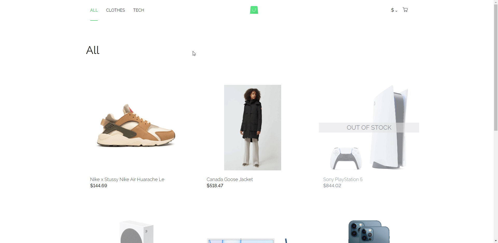

# Scandiweb assignment project

Frontend for an internet shop website.

## Functionality

- All data (products, currencies, prices and product categories) is from a provided GraphQL endpoint
- Category page with products of a given category
- Product display page with product details, image carousel and attribute selection (size, color, etc.)
- Products can be out of stock
- Fully functional cart modal and cart page - can add or remove products and see the total value
- Currency changer to change currency everywhere on the site
- All state information (products in cart, currently selected product category, selected currency) is stored in local
  storage to persist between sessions

## Technology

- [React.js](https://reactjs.org/) with class components (assigment requirement)
- CSS - CSS in JS with [Emotion](https://emotion.sh/), similiar to [styled-components](https://styled-components.com/) 
- [React Redux](https://react-redux.js.org/) for state management
- [React Router](https://reactrouter.com/) for routing
- [Opus](https://www.npmjs.com/package/@tilework/opus) for GraphQL requests
- [html-react-parser](https://www.npmjs.com/package/html-react-parser) to parse HTML in some product descriptions

## Design

Design was provided by Scandiweb in a Figma template.

### Presentation

###### Other information

This project was bootstrapped with [Create React App](https://github.com/facebook/create-react-app), using the [Redux](https://redux.js.org/) and [Redux Toolkit](https://redux-toolkit.js.org/) template.

